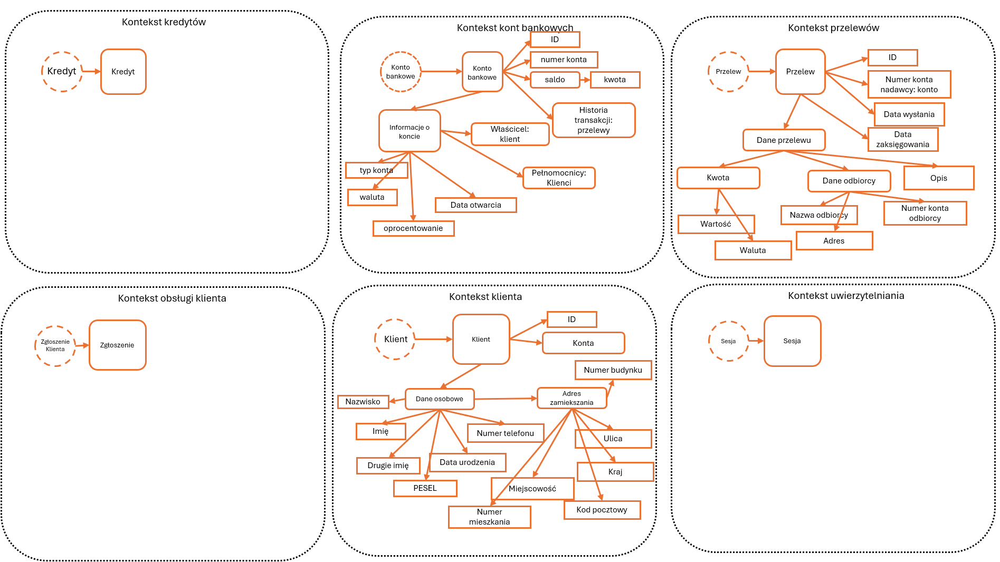

# Raport z wykonania zadania 1

## Model DDD

Modelowana aplikacja wzoruje się na realizacji usług bankowych udostępnianych przez bank Pekao.
Na modelu kółka przerywane to agregaty, kwadraty o obłych krawędziach to encje, a o ostrych VO.
Wyszczególnionych zostało 6 kontekstów. 
* Kontekst kredytów, zarządzanie kredytami, przyznawanie, spłacanie, naliczanie odsetek, obliczanie zdolności kredytowej. 
* Kontekst kont bankowych, odpowiedzialny za zarządzanie kontami bankowymi, ich otwieranie, śledzenie salda, oprocentowania. 
* Kontekst przelewów obsługuje wszystkie operacje przelewów między kontami (wewnętrznych i zewnętrznych).
* Kontekst obsługi klienta zajmuje się zgłoszeniami, wnioskami oraz relacjami z klientem.
* Kontekst klienta przechowuje informacje o klientach banku, takich jak dane osobowe, adresy, numery identyfikacyjne.
* Kontekst uwierzytelniania odpowiada za weryfikację tożsamości użytkowników systemu, autoryzację oraz bezpieczeństwo.

## Lista założeń:
* Konto bankowe (encja)
    * Atrybuty:
        - ID (VO): UUID
        - number konta: string - poprawny IBAN 28 znaków
        - saldo (VO)
            - kwota: int - ilość pieniedzy na koncie
        - informacje o koncie (VO)
            - typ konta: string - np. oszczednosciowe, osobiste, firmowe
            - waluta: string - np. PLN, EUR, USD jedna z istniejących
            - oprocentowanie: int - w przypadku kont oszczędnościowych 
            - data otwarcia: timestamp
            - pełnomocnicy: Lista[Klient] - lista pełnomocników, którzy mają dostęp do konta
            - właściciel: Klient - właściciel konta
        - historia transakcji: Lista[Przelew] - wszystkie transakcje są notabene przelewami, nie można ich edytować
* Przelew (encja)
    * Atrybuty: 
        - ID (VO): UUID
        - number konta nadawcy: Konto
        - data wysłania: - timestamp wysłania
        - data zaksiegowania: - timestamp sesji wysyłającej
        - dane przelewu (encja):
            - kwota (VO):
                - wartość: int
                - waluta: string np. PLN, EUR, USD jedna z istniejących
            - dane odbiorcy (VO):
                - nazwa odbiorcy: string
                - adres odbiorcy: string
                - numer konta odbiorcy: string
            - opis: string

* Klient (encja)
    * Atrybuty:
        - ID (VO): UUID
        - konta: lista[Konto bankowe] - lista przypisanych kont bankowych
        - dane osobowe (VO):
            - imię: string - od 3 do 64 znaków
            - drugie imię: string - od 3 do 64 znaków
            - nazwisko: string - od 3 do 64 znaków
            - PESEL: string - 11 cyfr
            - data urodzenia: timestamp 
            - numer telefonu: int
            - adres zamieszkania (VO):
                - ulica: string
                - kraj: string
                - kod pocztowy: string - 5 znaków
                - numer mieszkania: string - alfanumeryczny
                - numer budynku: string - alfanumeryczny

Zgodnie z Pana poleceniem tyle udało mi się zamodelować w zakładanym przedziale czasowym.